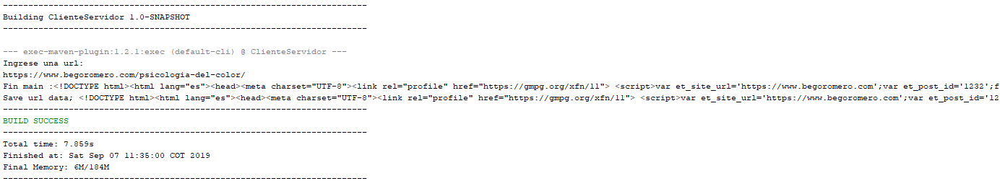
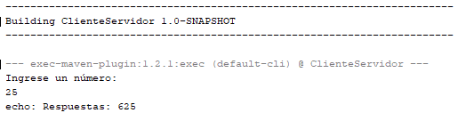
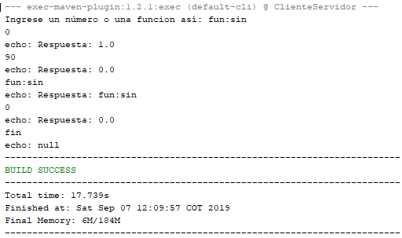
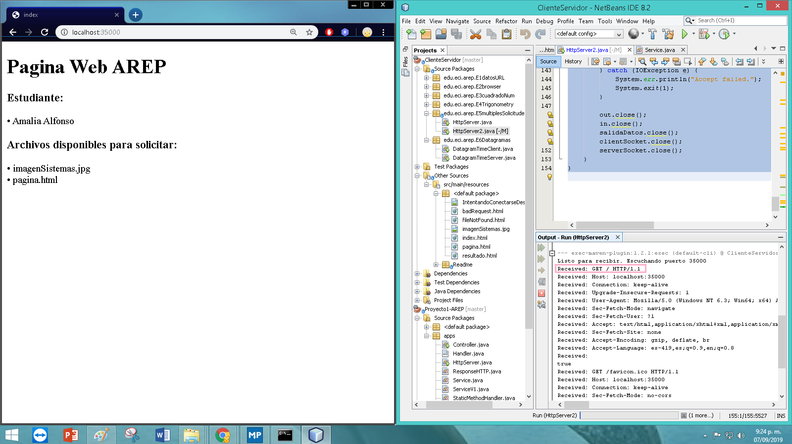
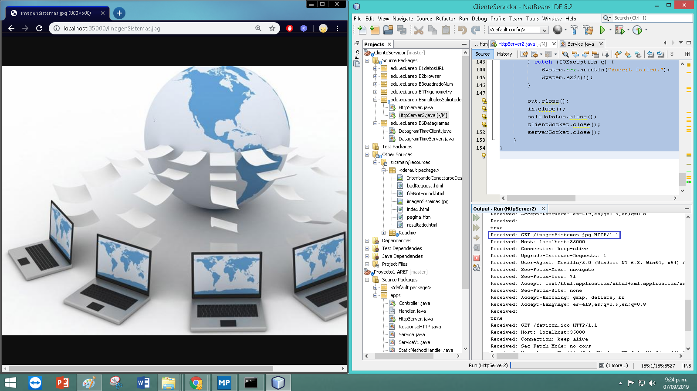
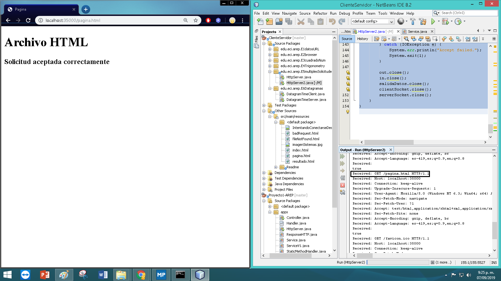
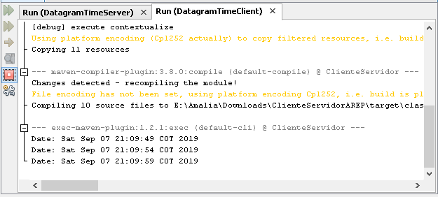
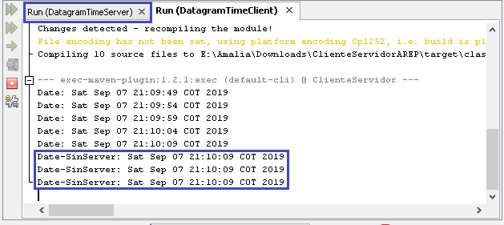
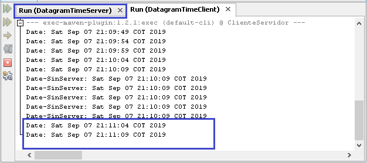

## Cliente - Servidor

En este repositorio, se implementó una aplicación web Cliente Servidor, en la cual se utilizaron sockets para la comunicación, Datagramas (protocolo UDP) 
___
### Insignias
]()
___
### Documentación

Para leer la documentación diríjase a: <https://github.com/acai-bjca/ClienteSevidorAREP/tree/master/src/main/resources/documentacion/apidocs/edu/eci/arep/spark>

___
### Uso del proyecto como librería
Si desea usar éste repositorio como librería en su proyecto, realice los siguientes pasos:

• Descargue o clone él repositorio SparkWebApp: <https://github.com/acai-bjca/SparkWebApp.git>

• Agregue la siguiente dependencia al pom de su proyecto:
``` xml
 <dependency>
	<groupId>edu.eci.arep</groupId>
    <artifactId>ClienteServidor</artifactId>
    <version>1.0-SNAPSHOT</version>
</dependency>
```

• Importe el proyecto en la clase que lo requiera:
import edu.eci.arep.*;
___
### Pruebas/Desarrollo
• **EJERCICIO 1:**
Leyendo los valores de un objeto URL.
Ejecute el archivo DatosURL de la carpeta E1datosURL.


• **EJERCICIO 2:**
Leyendo páginas de internet
Ejecute el archivo BrowserApp de la carpeta E2browser e ingrese una página web. Al ejecutarlo, la aplicación genera un archivo html con la información capturada de la página, el cua les guardado en <[https://github.com/acai-bjca/ClienteServidorAREP/blob/master/src/main/resources/pagina.html](https://github.com/acai-bjca/ClienteServidorAREP/blob/master/src/main/resources/resultado.html)>.




• **EJERCICIO 3:**
Servidor que recibe un número y responde el cuadrado de este número.
Diríjase a la carpeta E3cuadradoNum, ejecute priemro el archivo EchoServer, y luego EchoClient. Ingrese un número y la aplicación le dará el resultado. 




• **EJERCICIO 4:**
Servidor que recibe un número y responde el resultado de una operación trigonométrica sobre el número:
Ejecute la clase TrigonometryServer, luego TrigonometryClient e ingrese un número. Si dese finalizar infrese "fin".

El servidor recibe un núumero y responde con una operación sobre este número. Este servidor puede recibir un mensaje que empiece por “fun:”, si recibe este mensaje cambia la operación a las especificada. El servidor responde las funciones seno, coseno y tangente. Por defecto empieza calculando el coseno. Ejemplo: si el primer número que recibe es 0, debe responder 1, si después recibe π/2 debe responder 0, si luego recibe “fun:sin” debe cambiar la operación actual a seno, es decir a a partir de ese momento debe calcular senos. Si enseguida recibe 0 debe responder 0.



• **EJERCICIO 5:**
Servidor que soporta múltiples solicitudes seguidas (no concurrentes) de imágenes y archivos html.

- Ejecute el archivo HttpServer2 de la carpeta E5multiplesSolicitudes.

-Ingrese por el navegador al servidor:



-Solicite imagensistemas.jpg



-Solicite pagina.html




• **EJERCICIO 6:**
Programa que utiliza datagramas (usa protocolo UDP), se conecta a servidor y responde la hora actual en el servidor. El programa actualiza la hora
cada 5 segundos según los datos del servidor. Si una hora no es recibida debe
mantener la hora que tenía.

Para probar, ejecute la clase DatagramTimeServer y luego DatagramTimeClient, que se ubican en el repositorio E6Datagramas.

Para la prueba se apaga el servidor y después de
unos segundos se reactiva. El cliente debe seguir funcionando y actualizarse
cuando el servidor este nuevamente funcionando.

-Al encender servidor, se recibe la hora  cada 5 segundos.



-Se apaga servidor,y se mantiene la hroa actual.



-Se enciende neuvamente el servidor y la hora se actualiza cada 5 segundos.



___
### Construido con

• Java  
• [Maven] (https://maven.apache.org/) - Gestión de dependencias

___
### Autor

**Amalia Inés Alfonso Campuzano** 

Estudiante de la Escuela Colombiana de Ingeniería Julio Garavito

Ingeniería de Sistemas
___
### Licencia

Este proyecto está licenciado bajo la Licencia GNU - vea el archivo [LICENSE.md] (LICENSE.md) para más detalles.
